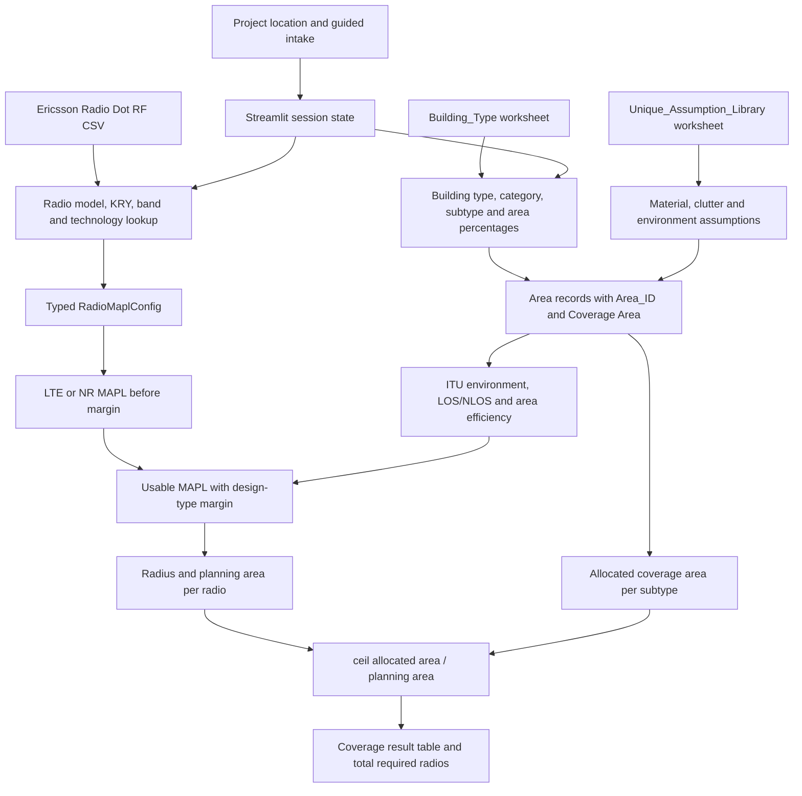

# RF ROM Tool Engineering Guide

**Audience:** RF engineers, RF solution architects, and technical users with basic Python familiarity<br>
**Implementation snapshot:** July 28, 2026<br>
**Application:** Ericsson AI-Assisted RF ROM Estimation Tool<br>
**Scope:** Current Streamlit intake, Ericsson Radio Dot lookup, LTE/NR MAPL, indoor coverage conversion, and required-radio estimation

## 1. Purpose of This Guide

This document explains how the RF ROM Tool works as an engineering system, not only how to operate its user interface. It connects:

- Each user question to its Python variable.
- The Excel and CSV reference data to the calculations.
- The Radio Dot lookup to LTE or NR MAPL.
- MAPL to the ITU indoor coverage model.
- Per-area coverage to the estimated number of required DOTs/radios.
- Warnings and confidence fields to the assumptions that caused them.

The tool is a planning-level ROM estimator. It is not a replacement for a calibrated iBwave design, site survey, walk test, SAS authorization, or final link-budget review.

## 2. The Tool in One Page

The application performs five engineering stages:

1. **Collect project and RF intake data.**
2. **Build the building/clutter area model** from the selected building type and category.
3. **Resolve the selected Ericsson Radio Dot RF characteristics** from a controlled CSV table.
4. **Calculate LTE or NR MAPL** using per-branch power, antenna gain, RB count, and target RSRP.
5. **Convert MAPL to indoor coverage** for every area type, then divide each allocated area by its planning coverage per radio.



## 3. Repository Architecture

| File or data source | Role | Primary inputs | Primary outputs |
| --- | --- | --- | --- |
| `main.py` | Streamlit UI and workflow orchestration | User selections, workbook data, session state | RF intake, editable area records, MAPL and coverage tables |
| `radio_reference.py` | Radio lookup, validation, typed RF configuration, MAPL | Radio model, KRY, band, technology, target RSRP | `RadioDotCharacteristics`, `RadioMaplConfig`, MAPL result dictionary |
| `coverage_engine.py` | Building normalization, ITU mapping, LOS/NLOS, coverage and radio count | Area record plus MAPL result | One normalized coverage result per area/band/technology |
| `data/ericsson_radio_dot_rf.csv` | Controlled Ericsson Radio Dot characteristics | Model, KRY, band and technology key | Frequency range, duplex mode, branches, power, gain and notes |
| `Sub_Type_RF_Assumptions_Losses.xlsx` | Building/subtype and RF assumption library | Building type, category and subtype | Area mix, materials, clutter, environment, layout and diagnostic losses |
| `tests/test_radio_reference.py` | Radio and MAPL regression coverage | Known radio combinations | Lookup, validation and numerical regression checks |
| `tests/test_coverage_engine.py` | ITU coverage regression coverage | Representative LTE/NR and building records | Mapping, margin, ranges and limiting-band checks |
| `tests/test_area_requirements.py` | Area-ID and radio-count checks | Area allocations and planning coverage | Rounded required-radio count and legacy-ID compatibility |
| `requirements.txt` | Runtime Python packages | Package names | Streamlit, pandas, NumPy, Matplotlib and openpyxl dependencies |

### 3.1 Runtime dependencies

- **Streamlit:** UI, session state, forms, data editors, maps and tables.
- **pandas:** Excel loading, table joins, numeric conversion and result tables.
- **openpyxl:** Excel engine used by pandas for `.xlsx` files.
- **Python standard library:** CSV parsing, dataclasses, math, HTTP address lookup and caching helpers.
- **OpenStreetMap Nominatim:** Optional address suggestions. RF calculations do not depend on it.

`numpy` and `matplotlib` are installed but are not central to the current MAPL-to-coverage workflow.

## 4. End-to-End Engineering Workflow

### 4.1 Project location

The user may enter an optional address and explicitly select **Search address** after entering at least three characters. The application does not send lookup requests while the user is typing.

1. `address_lookup.search_address()` calls the OpenStreetMap Nominatim search endpoint.
2. Up to five suggestions are returned.
3. A service, timeout, or rate-limit error is shown to the user; it is not represented as an empty search result.
4. Selecting an address, or manually entering coordinates, updates `location_latitude` and `location_longitude` in Streamlit session state.
5. The map is displayed only when the user toggles it.

The address, latitude and longitude are displayed in the RF Intake Summary. They do **not** currently change MAPL, propagation coefficients, regional bands, regulatory limits, or coverage.

### 4.2 Guided intake state machine

The intake is a list of question definitions in `main.py`. Only one question is shown at a time. Each answer is stored in:

```python
st.session_state.rf_intake_data
```

The current position is stored in:

```python
st.session_state.rf_intake_step
```

Three helper functions control navigation:

- `should_auto_fill_step()` decides whether a question is skipped.
- `visible_step_indices()` determines the current dynamic question count.
- `previous_visible_step_index()` makes Back navigation skip the same hidden questions.
- `finish_saved_intake_step()` returns a targeted edit to the completed state or asks only for dependent answers that were invalidated.

The progress bar is therefore based on the currently visible questions, not the static number of definitions. After completion, **Modify intake** lets the user select one previously answered field, preserve the other answers, and revisit only dependencies invalidated by that change.

### 4.3 Building and clutter model

After intake completion:

1. `Building_Type` and `Category` select rows from the workbook `Building_Type` sheet.
2. Each matching `Sub_Type_A` becomes an area record.
3. The user may edit `Sub_Type_Area_%` or add rows.
4. Coverage area is recalculated from total square footage.
5. Each subtype is joined to `Unique_Assumption_Library` to obtain material, clutter and environmental assumptions.
6. Each final row receives an `Area_ID`, such as `area-1`.

### 4.4 Radio and MAPL model

The selected model, KRY, band and technology are resolved against the Radio Dot CSV. The application then creates a validated `RadioMaplConfig` and calls:

```python
mapl_result = calculate_mapl(radio_config)
```

### 4.5 Indoor coverage model

For each area row, the application calls:

```python
calculate_building_coverage(area_record, mapl_result, margin_db=14.0)
```

The batch wrapper repeats the calculation for every area and every supplied MAPL result:

```python
calculate_coverage_for_all_buildings(
    building_df,
    mapl_results,
    margin_db=14.0,
    overrides=coverage_overrides,
)
```

## 5. Intake Questions and Their Engineering Use

The table below separates active calculation inputs from values collected for workflow, reporting, or future development.

| UI question | Program variable | Current dependency or transformation | Used in current RF formula? |
| --- | --- | --- | --- |
| Customer Name | `Customer_name` | Summary/reporting | No |
| Venue Name | `venue_name` | Becomes `Building_Name` in area records | No direct RF effect |
| Total Sq.Ft Coverage | `total_sqft` | Multiplied by each `Sub_Type_Area_%` | Yes, radio-count numerator |
| Number of Floors | `number_of_floors` | Stored in intake summary | **No current coverage effect** |
| General Building Type | `Building_type` | Filters workbook categories; fallback ITU mapping | Yes, indirectly |
| Building Category | `Building_category` | Filters workbook subtype rows | Yes, indirectly |
| Use Case Type | `use_case_type` | Selects 7 DOTs/IRU for Coverage Focused or 5.5 DOTs/IRU for Capacity Focused | Equipment conversion only |
| Equipment Type | `sol_type` | Filters Radio Dot versus Micro selections | Selection logic only |
| Operator Type | `Operator_type` | Determines private NR or public LTE/NR workflow | Yes |
| Coverage Type | `Coverage_type` | Maps 4G to LTE and 5G to NR | Yes |
| Target RSRP | `target_rsrp` | Becomes `target_rsrp_dbm` | Yes, MAPL |
| Radio Dot Model | `dot_type` | Normalized to `dot_model` | Yes, lookup key |
| Hardware Variant | `dot_variant_kry` | Exact KRY or unique inference | Yes, lookup key |
| Highest Frequency Band | `Limit_freq_type` | Normalized to RF band | Yes, lookup key and propagation frequency |
| Operators on Highest Band | `Operator_count` | Auto-set to 1 for private 5G; otherwise controls equal per-branch power sharing | Yes, MAPL when greater than 1 |
| Max Channels on Highest Band | `Max_lim_channel_count` | Hidden and fixed to 1 | No variable user input in current ROM |
| Power Sharing | `power_sharing` | Hidden; derived as `Operator_count > 1` | Yes, controls operator power split |

### 5.1 Conditional question rules

| Condition | Behavior |
| --- | --- |
| `Operator_type == Enterprise Private 5G` | Technology is NR; Coverage Type is auto-set to 5G; operator count, channel count and intake power sharing are auto-set to 1, 1 and False |
| `Operator_type == Enterprise 5G Coverage` | User selects Coverage Type 4G or 5G |
| Enterprise 5G Coverage with 4G | Technology is LTE; deployment bands are B25 and B66 |
| Enterprise 5G Coverage with 5G | Technology is NR; deployment bands are B77D and B77G |
| Enterprise Private 5G | Deployment band is B48 |
| One compatible hardware variant | Hardware-variant question is auto-filled and skipped; multiple variants remain selectable with supported bands shown |
| Public coverage workflow | Target RSRP question is skipped; calculation currently falls back to -95 dBm |
| Private 5G + DOT-IRU-BBU | DOT 4459 is the only Radio Model option |
| Enterprise 5G Coverage + DOT-IRU-BBU | DOT 2274 and DOT 4455 are available; DOT 4455 N77 is capped at 24 dBm/branch after operator sharing |

### 5.2 Dependent radio selectors

The intended dependency order is:

```text
Operator/Coverage Type
        -> Technology and allowed deployment bands
Equipment Type
        -> Radio family
Radio Dot Model
        -> Available KRY variants
KRY variant
        -> Supported bands
Band + technology
        -> Exact RF reference row
```

Changing an upstream selection clears incompatible downstream selections. For example, changing `dot_type` clears `dot_variant_kry` and `Limit_freq_type`.

## 6. Excel Workbook Data Dependency

The application reads:

```text
Sub_Type_RF_Assumptions_Losses.xlsx
```

### 6.1 `Building_Type` worksheet

Current size: 479 rows, 11 building types, 71 categories, and 348 unique `Sub_Type_A` values.

| Column | Current use |
| --- | --- |
| `Row_ID` | Source identifier; not used in calculations |
| `Building_Type` | General Building Type dropdown and area record |
| `Category` | Category dropdown filtered by building type |
| `Sub_Type_A` | Area type and join key to RF assumptions |
| `Sub_Type_Area_%` | Default fraction of total venue coverage |
| `Matched_Sub_Type` | Workbook evidence; not directly used by current engine |
| `Match_Confidence` | Workbook evidence; not directly displayed in results |
| `Match_Basis` | Workbook evidence; not directly used by current engine |
| `RF_Floorplan_Match_Notes` | Hover tooltip and editable note for added rows |

### 6.2 `Unique_Assumption_Library` worksheet

Current size: 348 rows with one row per unique `Sub_Type_A`.

| Variable group | Columns | Current use |
| --- | --- | --- |
| Material mix | `Concrete_%`, `Drywall_%`, `Glass_%`, `Metal_%` | Validated and reported; diagnostic in current ITU design |
| Clutter mix | `Open_Area_%`, `Light_Clutter_%`, `Medium_Clutter_%`, `Dense_Clutter_%` | LOS/NLOS and area-efficiency calculations |
| Geometry/context | `Ceiling_Height_Class`, `Environment_Type`, `Layout_Complexity` | Environment, LOS/NLOS, efficiency and warnings |
| Loss outputs | `Total Losses Material`, `Total Loss Density`, `Total Loss` | Diagnostic only unless a manual incremental loss override is supplied |
| Mapping | `Assumption_Profile`, `Assumption_Basis` | Primary ITU environment mapping and explanation |

### 6.3 Other workbook sheets

`Loss_Constants` defines representative values:

- Concrete 12 dB
- Drywall 4 dB
- Glass 3 dB
- Metal 18 dB
- Open clutter 1 dB
- Light clutter 3 dB
- Medium clutter 6 dB
- Dense clutter 10 dB

`Method_Notes` explains how workbook material, clutter and total losses were produced. The current Python engine does **not** load these two sheets directly. It reads the resulting loss columns from `Unique_Assumption_Library`, retains them as diagnostics, and does not subtract them automatically.

### 6.4 Area allocation formula

For each subtype:

```text
Area_Coverage_sqft = Total_SqFt_Coverage * Sub_Type_Area_% / 100
```

In code:

```python
edited_structure_df["Coverage Area"] = (
    total_coverage_sqft * area_pct_values / 100
).round(0).astype(int)
```

The UI warns when area percentages do not total 100%. It does not prevent the user from continuing, so the displayed area allocation can be above or below the venue total until corrected.

## 7. Radio Dot RF Reference and Lookup

The controlled reference file is:

```text
data/ericsson_radio_dot_rf.csv
```

### 7.1 Lookup key

One row represents a unique combination of:

```text
dot_model + dot_variant_kry + band + supported technology + duplex mode
```

### 7.2 Returned RF characteristics

| CSV field | Engineering meaning |
| --- | --- |
| `frequency_min_mhz`, `frequency_max_mhz` | Supported operating range |
| `technology` | LTE/NR support; WCDMA is informational only |
| `duplex_mode` | FDD or TDD |
| `tx_branch_count` | Number of transmit branches |
| `default_tx_power_dbm_per_branch` | Default power for one RF branch |
| `antenna_gain_dbi` | Integrated Dot antenna gain |
| `power_note` | Configuration or regulatory caution |

### 7.3 Current model summary

| Model / KRY | Bands | Technology | Default power per branch | Tx branches |
| --- | --- | --- | ---: | ---: |
| DOT 4455 / KRY 901 523/1 | B25, B66 | LTE/NR | 23 dBm | 2 |
| DOT 4455 / KRY 901 523/1 | B77D | NR | 26 dBm | 4 |
| DOT 4455 / KRY 901 551/1 | B41 | LTE/NR | 26 dBm | 2 |
| DOT 4455 / KRY 901 551/1 | B77G | NR | 26 dBm | 2 |
| DOT 4455 / KRY 901 551/1 | B77D | NR | 26 dBm | 4 |
| DOT 4459 / KRY 901 502/1 | B41K | LTE/NR | 26 dBm | 4 |
| DOT 4459 / KRY 901 516/1 | B48 | LTE/NR | 26 dBm | 4 |
| DOT 4459 / KRY 901 515/1 | B77D | NR | 26 dBm | 4 |
| DOT 2274 / KRY 901 468/1 | B25, B66 | LTE/NR | 23 dBm | 2 |

The antenna gain and frequency range remain row-specific. Consult the CSV for exact values.

### 7.4 Normalization examples

| Entered value | Normalized value |
| --- | --- |
| `4455`, `RD4455`, `DOT4455`, `Radio Dot 4455` | `DOT 4455` |
| `25`, `Band 25`, `PCS`, `B2/B25` | `B25` |
| `AWS`, `B4/B66` | `B66` |
| `CBRS`, `B48-CBRS` | `B48` |
| `N77`, `N77/C-Band`, `C-Band` | `B77D` |
| `4G` | `LTE` |
| `5G`, `5G NR` | `NR` |

### 7.5 KRY inference rule

The KRY may be inferred only when model + band + technology identifies one row. For example:

```text
DOT 4459 + B48 -> KRY 901 516/1
DOT 2274 + B25 -> KRY 901 468/1
```

DOT 4455 B77D exists under two KRY variants with different antenna gains. The engine therefore rejects a missing KRY rather than guessing.

### 7.6 Frequency selection precedence

```text
1. Validated user carrier-frequency override
2. Existing project/calculated frequency
3. Midpoint of the selected Radio Dot reference range
```

Examples of current reference midpoints:

| Band | Reference range | Midpoint used when no override exists |
| --- | --- | ---: |
| B25 | 1930-1995 MHz | 1962.5 MHz |
| B66 | 2110-2200 MHz | 2155 MHz |
| B41 | 2496-2690 MHz | 2593 MHz |
| B41K | 2515-2675 MHz | 2595 MHz |
| B48 | 3550-3700 MHz | 3625 MHz |
| B77G | 3450-3550 MHz | 3500 MHz |
| B77D | 3700-3980 MHz | 3840 MHz |

`coverage_engine.py` still contains legacy center-frequency aliases such as `N77/C-Band = 3750 MHz` for compatibility with older direct calls. The current Streamlit Radio Dot workflow passes `Frequency_MHz` from the RF reference, so B77D normally uses 3840 MHz, not the legacy 3750 MHz fallback.

### 7.7 CBRS limitation

DOT 4459 B48 returns this warning:

```text
Actual CBRS power may be lower because of SAS-authorized EIRP or PSD limits.
```

The tool does not calculate a dynamic SAS authorization limit. After operator sharing, it applies a fixed 23 dBm-per-branch cap whenever DOT 4459 is used for Enterprise Private 5G or Enterprise 5G Coverage. It also applies a 24 dBm-per-branch cap to DOT 4455 N77 for Enterprise 5G Coverage. A lower authorized or design-specific override remains unchanged.

## 8. Minimal Radio MAPL Schema

`RadioMaplConfig` is the calculation contract between UI inputs and the MAPL function.

| Schema field | Source in current Streamlit workflow | Unit |
| --- | --- | --- |
| `dot_model` | `rf_intake_data["dot_type"]` | text |
| `dot_variant_kry` | `rf_intake_data["dot_variant_kry"]` | text |
| `band` | `rf_intake_data["Limit_freq_type"]` | text |
| `technology` | `resolve_technology(Operator_type, Coverage_type)` | LTE/NR |
| `duplex_mode` | Radio reference row | FDD/TDD |
| `carrier_frequency_mhz` | Override or reference midpoint | MHz |
| `bandwidth_mhz` | Band default: N77/B77 80; B25/B66 20; other LTE 20; other NR 40 | MHz |
| `scs_khz` | LTE uses 15; current NR default is 30 | kHz |
| `tx_branch_count` | Radio reference row | count |
| `configured_tx_power_dbm_per_branch` | Advanced override or reference default | dBm/branch |
| `antenna_gain_dbi` | Radio reference row | dBi |
| `carrier_count` | Hidden `Max_lim_channel_count`, fixed to 1 | count |
| `power_share_count` | `Operator_count` | count |
| `power_is_total_across_carriers` | Derived `power_sharing`, true when operator count is greater than 1 | boolean |
| `target_rsrp_dbm` | Target RSRP or current -95 dBm fallback | dBm |
| `margin_db` | Centralized hidden UI policy selected from `Operator_type` | **15.5 dB Private 5G; 24.85 dB Enterprise 5G Coverage** |

Value precedence is:

```text
validated user override
    > existing project/calculated value
    > Radio Dot reference default
    > explicit application default
```

## 9. Step 1: LTE/NR MAPL Calculation

### 9.1 Current workflow defaults

| Parameter | LTE | NR |
| --- | ---: | ---: |
| Bandwidth | B25/B66 and other LTE: 20 MHz | N77/B77: 80 MHz; B25/B66: 20 MHz; other NR: 40 MHz |
| SCS | 15 kHz | 30 kHz |
| Target RSRP when no user value exists | -95 dBm | -95 dBm |
| Design margin passed by Streamlit | 15.5 dB for Enterprise Private 5G; 24.85 dB for Enterprise 5G Coverage | 15.5 dB for Enterprise Private 5G; 24.85 dB for Enterprise 5G Coverage |

The underlying typed schema still defines a generic 6 dB default for callers that omit margin. Both Streamlit applications call `resolve_streamlit_design_margin_db(Operator_type)`. The helper returns 15.5 dB for Enterprise Private 5G and 24.85 dB for Enterprise 5G Coverage; `STREAMLIT_DESIGN_MARGIN_DB = 14.0` remains the backward-compatible fallback for an empty or unknown deployment type.

### 9.2 Resource block tables

LTE:

| Bandwidth MHz | RB count |
| ---: | ---: |
| 1.4 | 6 |
| 3 | 15 |
| 5 | 25 |
| 10 | 50 |
| 15 | 75 |
| 20 | 100 |

NR FR1 at 30 kHz SCS:

| Bandwidth MHz | RB count |
| ---: | ---: |
| 5 | 11 |
| 10 | 24 |
| 15 | 38 |
| 20 | 51 |
| 25 | 65 |
| 30 | 78 |
| 40 | 106 |
| 50 | 133 |
| 60 | 162 |
| 70 | 189 |
| 80 | 217 |
| 90 | 245 |
| 100 | 273 |

The code also contains NR FR1 tables for 15 and 60 kHz SCS, although the current UI supplies 30 kHz.

### 9.3 Operator power-sharing rule

`Max_lim_channel_count` is hidden and fixed to one in the current ROM. The guided intake derives `power_sharing` directly from `Operator_count`. When one operator uses the highest band, no sharing loss is applied. When multiple operators use it, total per-branch power is split equally:

```text
Operator_Power_Sharing_Loss_dB = 10 * log10(Operator_Count)
```

```text
Shared_Tx_Power_dBm_per_Branch
    = Configured_Tx_Power_dBm_per_Branch
    - Operator_Power_Sharing_Loss_dB

Effective_Tx_Power_dBm_per_Branch
    = min(Shared_Tx_Power_dBm_per_Branch, Applicable_Model_Deployment_Cap)
```

The output retains the internal key `Carrier_Sharing_Loss_dB` for backward compatibility and also reports `Power_Share_Count`. Carrier count remains one and is not substituted for operator count. Model/deployment caps are evaluated only after this sharing reduction.

### 9.4 Branch EIRP

```text
Branch_EIRP_dBm
    = Effective_Tx_Power_dBm_per_Branch
    + Antenna_Gain_dBi
```

The engine does **not** add `10*log10(tx_branch_count)` to RSRP MAPL. Branch count is retained for MIMO/capacity reporting, but parallel branch powers are not combined as an automatic RSRP gain.

### 9.5 Power per resource element

```text
Total_Subcarriers = 12 * RB_Count
```

```text
Power_Per_RE_dBm
    = Branch_EIRP_dBm
    - 10 * log10(Total_Subcarriers)
```

The current implementation uses the same per-RE structural calculation for LTE and NR after selecting the appropriate RB count. RS, SSB, or CSI-RS boosting is not applied.

### 9.6 MAPL

```text
MAPL_Before_Margin_dB
    = Power_Per_RE_dBm
    - Target_RSRP_dBm
```

Because Target RSRP is negative, subtracting it increases MAPL. Example:

```text
0.26 dBm/RE - (-95 dBm) = 95.26 dB
```

The Step 1 display also reports:

```text
Final_MAPL_dB = MAPL_Before_Margin_dB - Margin_dB
```

Step 2 receives `MAPL_Before_Margin_dB`, not `Final_MAPL_dB`, and subtracts the same margin once. Therefore the margin is not double-counted.

## 10. Step 2: MAPL to Indoor Coverage

Step 2 uses one common propagation equation for LTE and NR. Technology affects coverage through Step 1 MAPL and carrier frequency, not through separate LTE/NR path-loss formulas.

### 10.1 ITU environment mapping priority

The engine selects an ITU environment in this order:

```text
1. Assumption_Profile exact mapping
2. Sub_Type_A keyword mapping
3. Environment_Type fallback
4. Building_Type fallback
5. Conservative office fallback
```

Returned fields include:

- `ITU_Environment`
- `Environment_Mapping_Reason`
- `Environment_Mapping_Confidence`
- warnings for approximate mappings

### 10.2 Assumption-profile mapping

An asterisk marks profiles treated as approximate and therefore assigned Medium confidence.

| ITU environment | Assumption profiles |
| --- | --- |
| Office | `Admin_Office`, `Bathroom`*, `Breakroom`, `Healthcare_Clinic`*, `Healthcare_Emergency`*, `Healthcare_Imaging`*, `Healthcare_OR_ICU`*, `Healthcare_Patient`*, `Hotel_Guestroom`*, `Lobby_Public`*, `Office_Dense`, `Office_Open`, `Office_Private`, `Residential_Living`*, `Retail_Sales`*, `Secure_Government` |
| Corridor | `Airport_Public`*, `Book_Stacks`*, `Concourse_Public`, `Corridor`, `Grocery`*, `Security_Screening`* |
| Industrial | `Baggage_Industrial`, `Bulk_Racking`, `Cleanroom`, `Cleanroom_Support`, `Data_Center`, `Gowning`, `Heavy_Production`, `IT_MEP`, `Kitchen_Service`, `Lab`, `Light_Assembly`, `Parking`*, `Port_Cargo`, `Power_Cooling`, `Storage`, `Warehouse`, `Workshop` |
| Conference | `Education_Classroom`, `Food_Court_Dining`*, `Gym_Auditorium`, `Library`*, `Meeting`, `Museum_Gallery`*, `Public_Seating`*, `Worship_Hall`* |

### 10.3 Keyword fallback

When no mapped `Assumption_Profile` exists, `Sub_Type_A` is searched in this order:

| ITU environment | Keywords |
| --- | --- |
| Corridor | corridor, concourse, aisle, circulation |
| Conference | conference, meeting, classroom, lecture, auditorium, sanctuary |
| Industrial | warehouse, production, storage, mechanical, utility, server, rack, lab, workshop, baggage, cargo |
| Office | office, admin, guestroom, patient, clinic, lobby, reception |

### 10.4 ITU coefficient sets

The equation uses frequency in GHz and distance in meters.

| Environment | Condition | alpha | beta | gamma | sigma dB | Frequency range GHz | Distance range m |
| --- | --- | ---: | ---: | ---: | ---: | --- | --- |
| Office | LOS | 1.47 | 34.17 | 2.08 | 3.68 | 0.3-294 | 2-27 |
| Office | NLOS | 2.39 | 30.13 | 2.40 | 5.01 | 0.3-255 | 4-30 |
| Corridor | LOS | 1.57 | 29.46 | 2.24 | 3.77 | 0.3-300 | 2-160 |
| Corridor | NLOS | 2.78 | 28.62 | 2.54 | 7.58 | 0.625-159 | 3-94 |
| Industrial | LOS | 2.27 | 24.79 | 2.10 | 2.62 | 0.625-294 | 2-102 |
| Industrial | NLOS | 2.80 | 23.55 | 2.16 | 5.70 | 0.625-255 | 3-110 |
| Conference | LOS | 1.56 | 30.47 | 2.23 | 2.92 | 0.45-300 | 2-21 |
| Conference | NLOS | 1.40 | 39.53 | 2.37 | 3.33 | 0.45-159 | 4-25 |

`sigma_db` is returned for engineering visibility but is not directly added to the deterministic radius equation. Reliability is currently controlled through the fixed design margin and any manual incremental loss.

### 10.5 LOS/NLOS classification

Clutter percentages must each be between 0 and 100 and should total 100%.

#### High-confidence LOS

All conditions must be true:

```text
Open_Area_% >= 55
Dense_Clutter_% <= 10
Medium_Clutter_% + Dense_Clutter_% <= 25
Layout_Complexity is Simple or Moderate
```

A simple `Corridor` profile also becomes LOS when open area is at least 40% and dense clutter is at most 10%.

#### NLOS indicators

- Very Complex layout.
- Dense clutter at or above 25%.
- Medium plus dense clutter at or above 45%.
- Open area at or below 20%.

Two or more indicators produce High confidence. One produces Medium confidence. Mixed indicators default conservatively to NLOS with Medium confidence. Invalid clutter data defaults to NLOS with Low confidence.

### 10.6 Incremental loss policy

Current automatic behavior:

```text
Additional_Loss_dB = 0
Loss_Calculation_Source = itu_coefficients_only
```

Even if workbook fields `Total Loss`, `Total Losses Material`, and `Total Loss Density` exist, they are not subtracted. This avoids combining:

1. Statistical obstruction effects represented by ITU environment and LOS/NLOS coefficients, and
2. Workbook planning losses that may describe the same materials and clutter.

An RF engineer may enter a manual `Additional Loss Override (dB)` when it represents a defensible incremental loss not already represented by the selected coefficient set.

### 10.7 Area efficiency

The ideal path-loss radius produces a circle. Real floorplans use that circle inefficiently because of layout and clutter.

First, a clutter-shape score is calculated:

```text
Clutter_Shape = (
    1.0 * Open_Area_%
  + 0.8 * Light_Clutter_%
  + 0.6 * Medium_Clutter_%
  + 0.3 * Dense_Clutter_%
) / Total_Clutter_%
```

Layout multipliers:

| Layout complexity | Multiplier | Fallback efficiency when clutter is invalid |
| --- | ---: | ---: |
| Simple | 1.00 | 0.85 |
| Moderate | 0.90 | 0.70 |
| Complex | 0.75 | 0.50 |
| Very Complex | 0.60 | 0.35 |

```text
Area_Efficiency = clamp(
    Clutter_Shape * Layout_Multiplier,
    minimum=0.30,
    maximum=1.00
)
```

### 10.8 Usable MAPL

```text
Usable_MAPL_dB
    = MAPL_Before_Margin_dB
    - Margin_dB
    - Additional_Loss_dB
```

The live Streamlit workflow currently uses:

```text
Margin_dB = 16
```

### 10.9 ITU site-general model

```text
Path_Loss_dB =
    10 * alpha * log10(Distance_m)
    + beta
    + 10 * gamma * log10(Frequency_GHz)
```

Set path loss equal to usable MAPL and solve for distance:

```text
Coverage_Radius_m = 10 ** (
    (
        Usable_MAPL_dB
        - beta
        - 10 * gamma * log10(Frequency_GHz)
    )
    / (10 * alpha)
)
```

### 10.10 Coverage areas

```text
Coverage_Diameter_m = 2 * Coverage_Radius_m
```

```text
Ideal_Area_m2 = pi * Coverage_Radius_m ** 2
```

```text
Ideal_Area_sqft = Ideal_Area_m2 * 10.7639104167
```

```text
Planning_Area_m2 = Ideal_Area_m2 * Area_Efficiency
```

```text
Planning_Area_sqft = Planning_Area_m2 * 10.7639104167
```

### 10.11 Required DOTs/radios

For each `Area_ID`:

```text
Number_of_required_DOTs_Radios = ceil(
    Area_Coverage_sqft / Planning_Area_sqft
)
```

Special cases:

- Zero area returns zero radios.
- Missing or negative area returns no count and a warning.
- Missing or nonpositive planning coverage returns no count and a warning.

### 10.12 Limiting result and displayed total

For each `Area_ID` and technology, the batch engine marks the row with the lowest `Planning_Area_sqft` as `Is_Limiting_Band=True`.

The main limiting message displays:

1. The valid result with the smallest planning area in the current result set.
2. The total required radios summed from valid rows marked as limiting for their area.

This avoids adding multiple band results for the same area when per-band calculations are introduced.

## 11. Advanced Overrides

### 11.1 Advanced RF Settings

| Control | Internal variable | Effect |
| --- | --- | --- |
| Override carrier frequency | `carrier_frequency_mhz` | Replaces reference midpoint after range validation |
| Override Tx power per branch | `configured_tx_power_dbm_per_branch` | Replaces the radio default; operator sharing is applied first, followed by any DOT 4459 or DOT 4455 N77 cap |
| Power is total across carriers | `power_is_total_across_carriers` | Subtracts `10*log10(carrier_count)` |

Antenna gain is not editable in the standard UI.

### 11.2 Advanced Coverage Overrides

Overrides are keyed by `Area_ID`.

| UI column | Internal override key | Effect |
| --- | --- | --- |
| ITU Environment Override | `environment` | Selects office, corridor, industrial or conference |
| LOS/NLOS Override | `condition` | Selects LOS or NLOS coefficients |
| Additional Loss Override (dB) | `additional_loss_db` | Subtracted from usable MAPL |
| Area Efficiency Override | `area_efficiency` | Replaces automatic clutter/layout formula; range 0.30-1.00 |

Manual choices appear in `Override_Fields` and use `Manual Override` confidence where applicable.

## 12. Output Data Dictionary

### 12.1 Step 1 RF calculation output

| Output | Meaning | Unit |
| --- | --- | --- |
| `Dot_Model`, `Dot_Variant_KRY` | Selected hardware | text |
| `Band`, `Technology`, `Duplex_Mode` | RF configuration | text |
| `Frequency_MHz` | Actual or midpoint carrier frequency | MHz |
| `Bandwidth_MHz`, `SCS_kHz`, `RB_Count` | Air-interface resource configuration | MHz, kHz, RB |
| `Tx_Branch_Count` | Hardware branch count | count |
| `Configured_Tx_Power_dBm_per_Branch` | Selected per-branch power before optional sharing | dBm |
| `Effective_Tx_Power_dBm_per_Branch` | Per-carrier branch power after sharing and any applicable deployment cap | dBm |
| `Antenna_Gain_dBi` | Integrated antenna gain | dBi |
| `Branch_EIRP_dBm` | Effective branch power plus antenna gain | dBm |
| `Power_Per_RE_dBm` | EIRP distributed over modeled subcarriers | dBm/RE |
| `Target_RSRP_dBm` | Design threshold | dBm |
| `MAPL_Before_Margin_dB` | Path-loss budget handed to Step 2 | dB |
| `Final_MAPL_dB` | Step 1 display after margin | dB |
| `Warnings`, `Override_Fields`, `Data_Source` | Traceability | text |

### 12.2 Step 2 coverage output

| Output | Meaning | Unit |
| --- | --- | --- |
| `Area_ID` | Stable per-run area key such as `area-1` | text |
| `Sub_Type` | Workbook `Sub_Type_A` | text |
| `Area_Coverage_sqft` | Allocated venue area for this subtype | sq ft |
| `Coverage_Type` | `lte_coverage` or `nr_coverage` | text |
| `Usable_MAPL_dB` | MAPL after margin and incremental loss | dB |
| `ITU_Environment`, `ITU_Condition` | Selected coefficient set | text |
| `Alpha`, `Beta`, `Gamma`, `Sigma_dB` | ITU coefficients | mixed/dB |
| `Coverage_Radius_m` | Solved maximum modeled radius | m |
| `Ideal_Area_sqft` | Circular geometric area | sq ft |
| `Area_Efficiency` | Practical floorplan multiplier | ratio |
| `Planning_Area_sqft` | Usable estimated coverage per radio | sq ft/radio |
| `Number_of_required_DOTs_Radios` | Rounded-up area requirement | count |
| `Frequency_Range_Valid` | Frequency inside coefficient range | Boolean |
| `Distance_Range_Valid` | Radius inside coefficient range | Boolean |
| `Result_Valid_For_Planning` | Both frequency and distance range checks passed | Boolean |
| `Calculation_Status` | ok, warning, extrapolated or error state | text |
| `Warnings` | Assumptions, fallbacks and model-range issues | text |

Legacy input records containing `Building_ID` are normalized to `Area_ID` for backward compatibility.

## 13. Worked LTE Example

Assumptions:

- DOT 2274, KRY 901 468/1
- B25 at midpoint 1962.5 MHz
- LTE 20 MHz, 100 RB
- 23 dBm per branch
- 1.3 dBi antenna gain
- Target RSRP -95 dBm
- Industrial NLOS area
- Complex layout and clutter-derived efficiency 0.42
- Area allocation 50,000 sq ft
- Fixed margin 14 dB

Step 1:

```text
Branch EIRP = 23.0 + 1.3 = 24.3 dBm
Total subcarriers = 12 * 100 = 1200
Power per RE = 24.3 - 10*log10(1200) = -6.4918 dBm/RE
MAPL before margin = -6.4918 - (-95) = 88.5082 dB
```

Step 2 using industrial NLOS coefficients:

```text
alpha = 2.80
beta = 23.55
gamma = 2.16
Usable MAPL = 88.5082 - 14 = 74.5082 dB
Coverage radius = 39.2693 m
Planning coverage = 21,901.62 sq ft/radio
Required radios = ceil(50,000 / 21,901.62) = 3
```

The calculated radius is within the industrial NLOS supported range of 3-110 m.

## 14. Worked NR Example

Assumptions:

- DOT 4459, KRY 901 502/1 selected for Enterprise 5G Coverage
- B41K at midpoint 2595 MHz
- NR 40 MHz, 30 kHz SCS, 106 RB
- 23 dBm per branch after the Enterprise 5G Coverage SAS policy cap
- 5.5 dBi antenna gain
- Target RSRP -95 dBm
- Industrial NLOS area
- Complex layout and clutter-derived efficiency 0.42
- Area allocation 50,000 sq ft
- Fixed margin 14 dB

Step 1:

```text
Branch EIRP = 23.0 + 5.5 = 28.5 dBm
Total subcarriers = 12 * 106 = 1272
Power per RE = 28.5 - 10*log10(1272) = -2.5449 dBm/RE
MAPL before margin = -2.5449 - (-95) = 92.4551 dB
```

Step 2:

```text
Usable MAPL = 92.4551 - 14 = 78.4551 dB
Coverage radius = 43.7945 m
Planning coverage = 27,240.14 sq ft/radio
Required radios = ceil(50,000 / 27,240.14) = 2
```

The result carries the Enterprise 5G Coverage power-policy warning. The policy cap is applied after any operator-sharing reduction.

## 15. Validation and Warning Logic

### 15.1 Radio reference validation

- Required CSV columns must exist.
- Frequency minimum must be positive and maximum must exceed minimum.
- Duplex mode must be FDD or TDD.
- Tx branch count must be a positive integer.
- Duplicate or conflicting lookup rows are rejected.
- LTE is rejected for NR-only rows.
- Ambiguous KRY configurations are rejected.
- Carrier frequency must lie within the selected radio range.
- Configured power must be between -10 and 40 dBm.
- Target RSRP must be between -140 and -40 dBm.
- Margin must be between 0 and 30 dB.
- LTE bandwidth and NR bandwidth/SCS combinations must exist in the RB tables.

### 15.2 Building and coverage validation

- Percentage values must be 0-100.
- Material and clutter groups are expected to total 100%.
- Area efficiency must be 0.30-1.00.
- MAPL and frequency must be positive.
- Margin and incremental loss must be non-negative.
- The selected ITU coefficient set must exist.
- Calculated radius must be finite and positive.
- Frequency and radius are checked against coefficient ranges.
- Radius above 1000 m or planning area above 10 million sq ft produces an extreme-result warning.

### 15.3 Confidence fields

Confidence is a mapping-quality indicator, not a statistical confidence interval:

- **High:** direct supported profile or clear LOS/NLOS evidence.
- **Medium:** approximate profile, keyword fallback, or mixed RF evidence.
- **Low:** broad fallback or incomplete data.
- **Manual Override:** user explicitly selected the value.

## 16. Testing and Verification

Run all tests from the project directory:

```powershell
python -m unittest discover -s tests -v
```

Current suite: 41 tests.

Major test groups:

- Radio model/band/KRY resolution.
- CBRS warning behavior.
- Ambiguous KRY rejection.
- LTE/NR RB and MAPL numerical regressions.
- Antenna gain applied exactly once.
- No automatic MIMO branch gain.
- Margin applied exactly once.
- Explicit carrier sharing only.
- Frequency passed into propagation.
- Environment and LOS/NLOS mapping.
- No material/clutter double-counting.
- Area-efficiency behavior.
- Model range warnings.
- Multiple-band limiting selection.
- `Area_ID` backward compatibility.
- Required-radio ceiling behavior.

Basic syntax verification:

```powershell
python -m py_compile main.py radio_reference.py coverage_engine.py
```

Run the application:

```powershell
streamlit run main.py --server.port 8507
```

## 17. How to Extend the Tool Safely

### 17.1 Add a Radio Dot model

1. Add rows to `data/ericsson_radio_dot_rf.csv`.
2. Use one row per unique model/KRY/band/technology/duplex combination.
3. Store numeric minimum and maximum frequencies.
4. Confirm power is per branch and document whether it is single-carrier.
5. Add lookup and numerical regression tests.
6. Do not add model-specific RF constants to `main.py`.

### 17.2 Make bandwidth and SCS user-driven

1. Add guided or advanced intake fields.
2. Map them to `bandwidth_mhz` and `scs_khz` in `build_radio_mapl_config()`.
3. Filter combinations using `LTE_RB_TABLE` or `NR_FR1_RB_TABLE`.
4. Add tests for every supported UI combination.

### 17.3 Add calibrated material/clutter losses

Do not simply subtract `Total Loss` from the current ITU result. First define what is incremental beyond the ITU coefficient set. A safe implementation path is:

1. Calibrate against measured or iBwave outcomes.
2. Define which loss components are already represented by environment/condition.
3. Add only the residual calibrated term as `additional_loss_db`.
4. Version and document the calibration dataset.
5. Add no-double-counting regression tests.

### 17.4 Add floor effects

`number_of_floors` is currently informational. A future floor model should distinguish:

- Total venue area versus per-floor area.
- Same-floor horizontal coverage.
- Inter-floor penetration loss.
- Radio reuse across floors.
- Floor-specific subtype mixes.

Do not divide the current required-radio result by floor count without defining those rules.

### 17.5 Add capacity sizing

`Use Case Type`, branch count, carrier count, bandwidth and operator count can support a later capacity engine. Keep capacity sizing separate from the median path-loss calculation, then reconcile coverage-driven and capacity-driven counts with:

```text
Required_Radios = max(Coverage_Driven_Count, Capacity_Driven_Count)
```

only after both engines have defined units and scope consistently.

## 18. Current Limitations and Engineering Gaps

1. **Calibrated UI margin:** The current live Streamlit workflow uses a centralized hidden margin of 15.5 dB for Enterprise Private 5G and 24.85 dB for Enterprise 5G Coverage. An unknown deployment type falls back to 14 dB.
2. **Band-default bandwidth/SCS:** N77/B77 uses 80 MHz; B25/B66 uses 20 MHz for LTE or NR; other LTE uses 20 MHz and other NR uses 40 MHz. NR uses 30 kHz SCS.
3. **Public target RSRP:** Enterprise 5G Coverage currently falls back to -95 dBm because its target question is skipped.
4. **Micro equipment chain:** Micro 4402/4408 RF characteristics and radio counts are supported, but IRU/BBU conversion is not shown because no Micro Radio-to-baseband ratio is defined.
5. **Floors:** Number of floors does not affect coverage or radio count.
6. **Capacity:** Capacity Focused changes the equipment conversion to 5.5 DOTs per IRU, but does not yet invoke a traffic-capacity radio-sizing model.
7. **Materials:** Material and workbook total losses are diagnostic, not automatic incremental loss.
8. **Ceiling height:** High ceiling currently produces a warning but no dB correction.
9. **Sigma:** ITU sigma is reported but not directly applied.
10. **Floorplan geometry:** Area efficiency is a scalar approximation; no polygon, wall-object or corridor-routing model is used.
11. **SAS:** Dynamic SAS authorization limits are not calculated; DOT 4459 uses a fixed 23 dBm-per-branch cap for both deployment types after operator sharing, although the guided Enterprise 5G Coverage intake no longer offers that radio. Enterprise 5G Coverage DOT 4455 N77 uses a fixed 24 dBm-per-branch cap after sharing.
12. **Multiple bands:** The engine supports multiple MAPL records, but the current UI runs one selected band at a time.
13. **Location:** Address and coordinates do not select regulatory domain or propagation parameters.

## 19. Troubleshooting Guide

| Symptom | Likely cause | Check |
| --- | --- | --- |
| Unsupported Radio Dot model | Model absent from RF CSV, especially a Micro radio | `data/ericsson_radio_dot_rf.csv` |
| More than one hardware variant | Model/band combination is ambiguous | Select exact KRY |
| Unsupported band | Deployment filter or RF table does not support the combination | Operator Type, Coverage Type, model and KRY |
| Frequency outside range | Advanced override is outside selected row limits | RF reference min/max |
| Unsupported NR bandwidth/SCS | Pair absent from `NR_FR1_RB_TABLE` | Bandwidth and SCS |
| Very large radius | LOS coefficients, high MAPL, low margin, or model extrapolation | `Distance_Range_Valid`, warnings, environment and condition |
| Required-radio count missing | Missing/negative area or nonpositive planning area | `Area_Coverage_sqft`, `Planning_Area_sqft`, warnings |
| Area total differs from venue total | Subtype percentages do not sum to 100% | Building and Clutter Information editor |
| Material losses appear but do not reduce radius | Intentional no-double-counting policy | `Loss_Calculation_Source` and warnings |
| CBRS output may be optimistic | Dynamic SAS authorization is not modeled | Use an authorized value at or below the applicable fixed policy cap |

## 20. RF and Python Glossary

| Term | Meaning in this tool |
| --- | --- |
| dBm | Absolute power referenced to 1 mW |
| dBi | Antenna gain relative to isotropic |
| dB | Gain/loss ratio, including MAPL and margin |
| MAPL | Maximum allowable path loss under the modeled RSRP assumptions |
| RSRP | LTE reference signal received power target |
| SS-RSRP | NR synchronization-signal RSRP concept represented by the same target variable in the current engine |
| RB | Resource block selected from LTE or NR tables |
| RE | Resource element; current power normalization uses total subcarriers `12*RB` |
| EIRP | Effective branch power plus antenna gain |
| LOS/NLOS | Line of sight / non-line of sight coefficient selection |
| `dict` | Python key/value record used for intake, MAPL and coverage values |
| `dataclass` | Typed Python container used for radio characteristics and MAPL configuration |
| `DataFrame` | pandas table used for building records and calculation results |
| session state | Streamlit storage that preserves answers across reruns |

## 21. Recommended Review Checklist Before Using a ROM Result

1. Confirm selected model, KRY, band and technology are physically correct.
2. Confirm the displayed frequency is appropriate, not only the range midpoint.
3. Confirm per-branch power and any carrier-sharing interpretation.
4. Review the CBRS warning where applicable.
5. Confirm target RSRP and understand the selected design-type margin (15.5 dB Private 5G or 24.85 dB Enterprise 5G Coverage).
6. Confirm subtype percentages total 100%.
7. Review each area environment, LOS/NLOS reason and confidence.
8. Review any model frequency/distance extrapolation warning.
9. Confirm material/clutter totals are being treated as diagnostics.
10. Treat the radio count as a ROM quantity pending floorplan and capacity validation.
